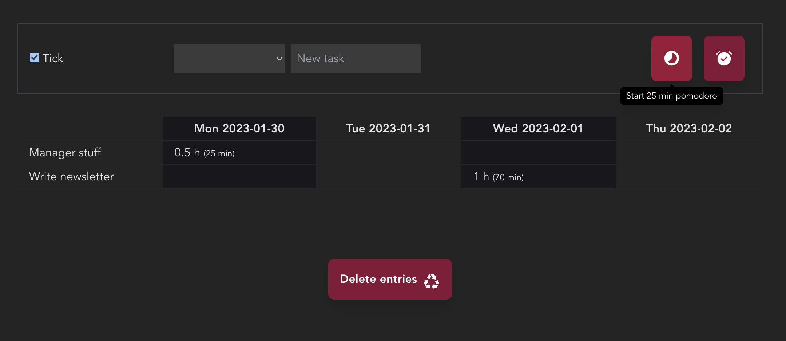

# Time Tracker

Tiny time tracker to keep track of time. LOL.

Enter task, start pomodoro or regular timer. Get a (weekly) report of your spent time.

Featuring stressful ticking sounds, unintuitive keyboard navigation & probably a lot of hidden bugs.

Quick & dirty prototype to serve my own time tracking needs.

## Screenshots


## Tech Stack


   

## Environment Variables

To run this project, you will need to add the following environment variables to your .env file, and create a Firestore database.

`VITE_APP_FIREBASE_API_KEY`

`VITE_APP_FIREBASE_AUTH_DOMAIN`

`VITE_APP_FIREBASE_PROJECT_ID`

`VITE_APP_FIREBASE_STORAGE_BUCKET`

`VITE_APP_FIREBASE_MESSAGING_SENDER_ID`

`VITE_APP_FIREBASE_APP_ID`

## Run Locally

Install dependencies

```bash
  pnpm install
```

Start the server

```bash
  pnpm run dev
```

## Deployment
Modify the `.github/workflows/firebase-hosting-merge.yml` to match your project settings, or run the Firebase CLI tools for automatic deployment.

Configure `firestore.rules` file with proper security rules.

## Lessons Learned
- How much I love automatic Firebase deploy scripts even if they need some version number tweaking
- Grouping data
- How hard it is to document your own projects
- TypeScript is OK.

## Credits
### Audio files and license
Orangefreesounds.com License: The sound effect is permitted for non-commercial use under license  Attribution-NonCommercial 4.0 International (CC BY-NC 4.0)
- https://orangefreesounds.com/ticking-noise/
- https://orangefreesounds.com/correct-answer-ding-sound-effect/
